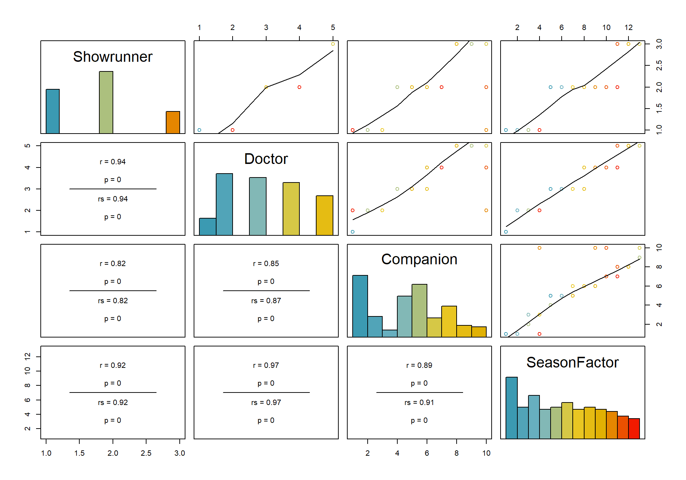
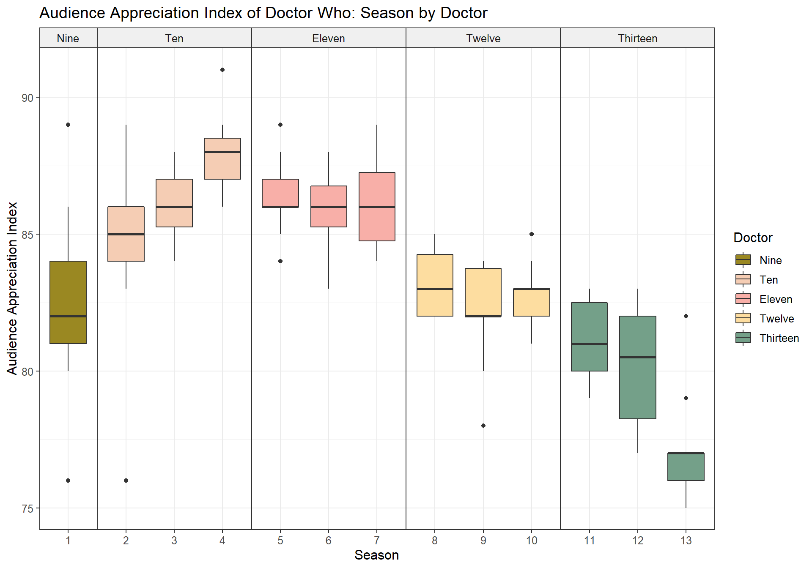

# Doctor Who Through the Ages
An analysis of three metrics of the show for S01-S13

- The analysis was written in R using RMarkdown [doctorwho.Rmd](doctorwho.Rmd). 
- **To view the analysis, see [doctorwho.html](doctorwho.html).** The contents are identical to the README.md, but easier to navigate due to tabsets. 
- The raw data can be viewed in [doctorwho.csv](doctorwho.csv).

# What can data tell us about quality of Doctor Who (2005)?
As a long time fan of Doctor Who (2005), I hit a wall watching the show around 2020. I really wanted to like the new (Thirteenth) Doctor, but somehow the show just wasn't as magical anymore as it used to be in the old days. After I suffered through *Orphan 55*, I glanced over the `IMDb Ratings` of the show, and realized that I did not seem to be alone. The ratings had gone down significantly, and I wondered why this might be. 

So I created a spreadsheet and plotted the data of the ratings. I considered more advanced methods of analysis, but the problem with this data is that all of it is highly correlated, as we will soon see.

To illustrate these correlations, let me first introduce the 3 types of data in this dataset: `IMDb ratings`, the `UK viewerships` numbers, and the Audience Appreciation Index (`AI`). All of these are highly correlated. 

- The IMDb Ratings were exported from IMDb in April 2020 (S01-S12) and January 2023 (S13). 
- The values for UK viewership data and AI are taken from this site: https://www.doctorwhotv.co.uk/doctor-who-series-13-2021-22-uk-ratings-accumulator-95514.htm
- As also explained there, the British Audience Appreciation Index (AI) is a score out of 100 which is used as an indicator of the public’s appreciation for a show. Over 90 is considered exceptional, 85 or over is excellent, 60 or less is poor, and less than 55 is very poor. 


## Correlations

Let's take a look at these different types of data. Here is a plot illustrating how these correlate: 

```{r}
pairscor.fnc(df[,c("IMDb.Rating", "UK.Viewers", "AI")], col.points = colors12)
```


We can see that especially the `AI` and the `UK viewership` are highly correlated. The `IMDb ratings` are less correlated especially with the viewership numbers (r = 0.29), but there is still a visible trend in the scatterplot. Therefore, we can assume that all three values will produce similar results in an advanced analysis. 

There are also a number of different categorical variables in the data, which describe meta information, such as the name of the showrunner, who Doctor is the main character of the show, which companion, and which season. All of these are indeed extremely highly correlated, as illustrated in this chart: 


```{r}
pairscor.fnc(df[,c("Showrunner", "Doctor", "Companion", "SeasonFactor")], col.points = colors12)
```


What does this mean for the analysis? For one, regression is only minimally possible, as correlated variables should not be included in the same regression model (more on that later).

*Which data type is the most meaningful?* This is a question up for debate. While `UK Viewers` and `AI` give a good overview of the initial impact of the episode within its country of origin, they do not take into account viewer's appreciation after a certain amount of time. The `IMDb Rating`, on the other hand, is not restricted by temporal or geographical cut-off points, as anyone can rate episodes any time. Therefore, this rating is likely to be a better indicator of the quality of the show even after some time, especially in the present day where the watching of TV shows has become a highly desynchronized and individual experience, with streaming being more popular than Live TV. 

# Which seasons are the best and worst?
For now, let us look at the individual seasons. Which seasons are the best and the worst? To get an overview of the three metrics, we can summarize their means for each individual season: 

```{r}
df %>%
  group_by(SeasonFactor) %>%
  summarise(
    across(IMDb.Rating, mean), 
    across(UK.Viewers, mean), 
    across(AI, mean)
  )
```

|SeasonFactor | IMDb.Rating| UK.Viewers|       AI|
|:------------|-----------:|----------:|--------:|
|1            |    8.007692|   7.947692| 82.23077|
|2            |    7.900000|   7.866429| 84.42857|
|3            |    8.071429|   7.677857| 86.21429|
|4            |    8.305263|   9.231579| 87.84211|
|5            |    8.153846|   7.730000| 86.15385|
|6            |    8.092857|   7.843571| 86.00000|
|7            |    7.843750|   8.136250| 86.06250|
|8            |    7.807692|   7.560769| 83.30769|
|9            |    8.142857|   6.312857| 82.21429|
|10           |    7.730769|   5.637692| 82.76923|
|11           |    6.091667|   7.885000| 81.00000|
|12           |    6.250000|   5.398000| 80.20000|
|13           |    6.477778|   4.652222| 77.22222|

From this, we can observe that the mean values are lower in S11-13 than in most other seasons, while the highest values appear to be in S04. How does this data look like when visualized? 

For this, we can look at boxplots of this data. For this, we first remove two datapoints because they cause problems in the plots as they have mismatching Doctors/Seasons. 

```{r}
dfboxplot <- subset(df, EpCode != "11.00" & EpCode != "08.00" )
```

## Aggregated Boxplots
Then we can plot the data as follows for the 3 metrics. We can see that the `IMDb ratings` took a notable dip in S11-13, while in earlier seasons they were more favorable. `UK viewership` shows a slightly different picture - it was highest for S04, and  notably less for the Twelfth and Thirteenths Doctors (even though in their respective first seasons, viewers were still enthusiastic). The `AI` shows the show being at an all-time high during the Tenth Doctor, followed by the Eleventh. The Thirteeth Doctor with S13 is very far behind.  

### IMDb Rating 
```{r}
ggplot(dfboxplot, aes(x=SeasonFactor, y=IMDb.Rating, fill=Doctor)) + 
    geom_boxplot() +
    theme_bw() +
    scale_fill_manual(values = wes_palette("Royal2", 5, type = "continuous")) +
    labs(x = "Season", y = "IMDb Rating", 
         title="IMDb Ratings of Doctor Who: Season by Doctor", 
         colour = "", shape = "") +
    facet_grid(.~Doctor, space="free", scales="free") +
    theme(text = element_text(size = 12),
        strip.background =element_rect(fill="#f0f0f0"),
        panel.spacing.x = unit(0, "lines")) 
```


### UK Viewers
```{r}
ggplot(dfboxplot, aes(x=SeasonFactor, y=UK.Viewers, fill=Doctor)) + 
    geom_boxplot() +
    theme_bw() +
    scale_fill_manual(values = wes_palette("Royal2", 5, type = "continuous")) +
    labs(x = "Season", y = "UK Viewers (million)", 
         title="UK Viewers of Doctor Who: Season by Doctor", 
         colour = "", shape = "") +
    facet_grid(.~Doctor, space="free", scales="free") +
    theme(text = element_text(size = 12),
        strip.background =element_rect(fill="#f0f0f0"),
        panel.spacing.x = unit(0, "lines")) 
```


### Audience Appreciation Index 
```{r}
ggplot(dfboxplot, aes(x=SeasonFactor, y=AI, fill=Doctor)) + 
    geom_boxplot() +
    theme_bw() +
    scale_fill_manual(values = wes_palette("Royal2", 5, type = "continuous")) +
    labs(x = "Season", y = "Audience Appreciation Index", 
         title="Audience Appreciation Index of Doctor Who: Season by Doctor", 
         colour = "", shape = "") +
    facet_grid(.~Doctor, space="free", scales="free") +
    theme(text = element_text(size = 12),
        strip.background =element_rect(fill="#f0f0f0"),
        panel.spacing.x = unit(0, "lines")) 
```


## Plots by individual episode for each season
As any Doctor Who (2005) fan knows, the quality of the show can fluctuate intensely even within seasons (facets). For example, while the Tenth Doctor appears to be the all-time favorite, even during his tenure there were some commonly agreed upon very-very-bad episodes. Points are colored shapes for each Doctor, while the trendlines show an allover trend in ratings for each season.

Plotting `IMDb ratings` of all episodes over all 13 seasons illustrates this nicely - for example, *Fear Her* and *Love and Monsters* are at the lower end of the scale in S02, whereas the show's highest ever rated episode *Blink* towers above everything else in S03. 

Plotting the `UK viewers`, on the other hand, shows very different trends - across all seasons, we can see an initial interest during the first couple of episodes, then a decline in viewership, usually followed by somewhat more interest in the final episodes, or special episodes. 

The `AI` is more varied, and while there are notable outliers here as well, it is for example questionable as to why *Blink* doesn't appear as an outlier in S03, which is in the fandom generally accepted as one of the show's best episodes ever.  

### IMDb Rating
```{r}
ggplot(data = df, aes(x=EpCodeFactor, y=IMDb.Rating,label=Episode.Title)) + 
  theme_bw() +
  geom_point(aes(colour = factor(Doctor), shape = factor(Doctor)), size=3) +
  geom_smooth(aes(group=Season), colour = "gray", fill= "gray85") +
  scale_shape_manual(values = c(18, 19, 17, 15, 19)) +
  scale_colour_manual(values = wes_palette("FantasticFox1", 5, type = "continuous")) +
  facet_grid(.~Season, space="free", scales="free") +
  theme(axis.text.x = element_text(angle = 90, vjust = 0.5, hjust=1, size = 7),
        text = element_text(size = 12),
        legend.position = "bottom",
        strip.background =element_rect(fill="#f0f0f0"),
        panel.spacing.x = unit(0, "lines")) +
  ylim(4.1, 9.8) +
  labs(x = "Season / Episode", y = "IMDb Rating", 
       title="IMDb Ratings of Doctor Who: Season by Doctor", 
       colour = "", shape = "")
```


### UK Viewership
```{r}
ggplot(data = df, aes(x=EpCodeFactor, y=UK.Viewers,label=Episode.Title)) + 
  theme_bw() +
  geom_point(aes(colour = factor(Doctor), shape = factor(Doctor)), size=3) +
  geom_smooth(aes(group=Season), colour = "gray", fill= "gray85") +
  scale_shape_manual(values = c(18, 19, 17, 15, 19)) +
  scale_colour_manual(values = wes_palette("FantasticFox1", 5, type = "continuous")) +
  facet_grid(.~Season, space="free", scales="free") +
  theme(axis.text.x = element_text(angle = 90, vjust = 0.5, hjust=1, size = 7),
        text = element_text(size = 12),
        legend.position = "bottom",
        strip.background =element_rect(fill="#f0f0f0"),
        panel.spacing.x = unit(0, "lines")) +
  ylim(3.3, 13.35) +
  labs(x = "Season / Episode", y = "UK Viewers (million)", 
       title="UK Viewers of Doctor Who: Season by Doctor", 
       colour = "", shape = "")
```


### Audience Appreciation Index
```{r}
ggplot(data = df, aes(x=EpCodeFactor, y=AI,label=Episode.Title)) + 
  theme_bw() +
  geom_point(aes(colour = factor(Doctor), shape = factor(Doctor)), size=3) +
  geom_smooth(aes(group=Season), colour = "gray", fill= "gray85") +
  scale_shape_manual(values = c(18, 19, 17, 15, 19)) +
  scale_colour_manual(values = wes_palette("FantasticFox1", 5, type = "continuous")) +
  facet_grid(.~Season, space="free", scales="free") +
  theme(axis.text.x = element_text(angle = 90, vjust = 0.5, hjust=1, size = 7),
        text = element_text(size = 12),
        legend.position = "bottom",
        strip.background =element_rect(fill="#f0f0f0"),
        panel.spacing.x = unit(0, "lines")) +
  ylim(75, 91) +
  labs(x = "Season / Episode", y = "Audience Appreciation Index", 
       title="Audience Appreciation Index of Doctor Who: Season by Doctor", 
       colour = "", shape = "")
```


# Which companion(s) is/are most popular?
A good companion makes a good Doctor, because at the heart of the show, it's about the Doctor showing their companion all of time and space. So which companions are the most appreciated? 

Before we try to answer that question, let us remove all episodes with guests from the dataset, as they don't give us any true insight into this question and we're only interested in regulars. 

```{r}
dfcorecompanions <- subset(df, Companion != "Guest" )
```

Then we can look at the mean values of `IMDb rating`, `UK Viewers` and `AI` summarized for each companion's tenure.

```{r}
dfcorecompanions %>%
  group_by(Companion) %>%
  summarise(
    across(IMDb.Rating, mean), 
    across(UK.Viewers, mean), 
    across(AI, mean)
  )
```

|Companion          | IMDb.Rating| UK.Viewers|       AI|
|:------------------|-----------:|----------:|--------:|
|Rose               |    7.993103|   8.198621| 83.68966|
|Martha             |    8.107692|   7.549231| 86.38462|
|Donna              |    8.357143|   8.140000| 87.78571|
|Amy                |    8.080000|   8.762000| 85.80000|
|Amy & Rory         |    8.071429|   7.752500| 86.25000|
|Clara              |    7.927778|   7.182778| 83.58333|
|Bill               |    7.784615|   5.644615| 82.69231|
|Yaz, Ryan & Graham |    6.071429|   6.699048| 80.61905|
|Yaz & Dan          |    6.325000|   4.596250| 76.62500|

Donna is undoubtedly the most popular companion, which is not surprising as Donna and the Doctor had great chemistry and both appeared in some of the most fun, as well as in some of the most compelling episodes together. 

The Thirteeth's companions, are less lucky, as they appeared in the least popular episodes. 

Personally, I would have expected Bill to be higher on the list, and I believe she is one of the most under-appreciated companions and had a great dynamic with Twelve. 

## Aggregated Boxplots

The boxplots visualize the above data, and highlight some notable mismatches. For example, while the `IMDb ratings` for *Yaz & Dan* are more favorable, the `AI` puts them all the way at the bottom. 

### IMDb Rating 
```{r}
ggplot(dfcorecompanions, aes(x=Doctor, y=IMDb.Rating, fill=Companion)) + 
    geom_boxplot() +
    theme_bw() +
    scale_fill_manual(values = wes_palette("FantasticFox1", 10, type = "continuous")) +
    labs(x = "Season", y = "IMDb Rating", 
         title="IMDb Ratings of Doctor Who: Season by Doctor", 
         colour = "", shape = "") +
    facet_grid(.~Doctor, space="free", scales="free") +
    theme(text = element_text(size = 12),
        strip.background =element_rect(fill="#f0f0f0"),
        panel.spacing.x = unit(0, "lines")) 
```


### UK Viewers
```{r}
ggplot(dfcorecompanions, aes(x=Doctor, y=UK.Viewers, fill=Companion)) + 
    geom_boxplot() +
    theme_bw() +
    scale_fill_manual(values = wes_palette("FantasticFox1", 10, type = "continuous")) +
    labs(x = "Season", y = "UK Viewers (million)", 
         title="UK Viewers of Doctor Who: Season by Doctor", 
         colour = "", shape = "") +
    facet_grid(.~Doctor, space="free", scales="free") +
    theme(text = element_text(size = 12),
        strip.background =element_rect(fill="#f0f0f0"),
        panel.spacing.x = unit(0, "lines")) 
```


### Audience Appreciation Index 
```{r}
ggplot(dfcorecompanions, aes(x=Doctor, y=AI, fill=Companion)) + 
    geom_boxplot() +
    theme_bw() +
    scale_fill_manual(values = wes_palette("FantasticFox1", 10, type = "continuous")) +
    labs(x = "Season", y = "Audience Appreciation Index", 
         title="Audience Appreciation Index of Doctor Who: Season by Doctor", 
         colour = "", shape = "") +
    facet_grid(.~Doctor, space="free", scales="free") +
    theme(text = element_text(size = 12),
        strip.background =element_rect(fill="#f0f0f0"),
        panel.spacing.x = unit(0, "lines")) 
```


## Plot by individual episode 
How does this look when plotting all individual episodes? The following plots illustrate the relationship between the different Doctors (facets) with their companions (colored shapes). Additionally, the trendlines illustrate the allover trend in ratings for each Doctor. 

The Tenth Doctor continues to be the most appreciated for all metrics, with increasing popularity once Donna entered the show. 

Another interesting observation in the `IMDb ratings` is the S-curve we can see for the Thirteenth Doctor once the composition of her companions changed - however, towards the end of S13 this dipped again. `UK Viewership`, on the other hand, shows a steady decline for all of Thirteenth's tenure, regardless of companion.

Notable outliers in most of these charts are the guest companions - these usually appeared in Christmas or other special episodes, which tend to have an allover much higher viewership. 

When taking a closer look at the individual episodes, it also becomes apparent that particularly `UK Viewership` does not seem to be a good indicator of the quality of the show, as episodes such as *Blink*, *Silency in the Library* or *Heaven Sent* had very low viewership, but are generally some of the best episodes of the show (see `IMDb rating`). 

Similarly, the `AI` for *Heaven Sent* is very confounding, as it appears as one of the lowest episodes for Twelve on this scale, but it is, IMHO, without a doubt, Twelve's best performance ever. 

### IMDb Rating
```{r}
ggplot(data = df, aes(x=EpCodeFactor, y=IMDb.Rating,label=Episode.Title)) + 
  theme_bw() +
  geom_point(aes(colour = factor(Companion), shape = factor(Companion)), size=3) +
  scale_shape_manual(values = c(8, 19, 17, 20, 19, 18, 64, 2, 0, 15)) +
  scale_colour_manual(values = wes_palette("Darjeeling1", 10, type = "continuous")) +
  geom_smooth(aes(group=Doctor), colour = "gray60", fill= "gray85") +
  geom_text(aes(label=ifelse(IMDb.Rating>9.3, as.character(Episode.Title), '')),
            hjust=1.1,
            vjust=0.3, 
            color = "gray50", 
            size = 2.8) +
  geom_text(aes(label=ifelse(IMDb.Rating<4.9, as.character(Episode.Title), '')),
            #ifelse(EpCodeFactor == "11.05", hjust=0.05, hjust=1.05),
            hjust=1.05,
            vjust=0.3, 
            color = "gray50", 
            size = 2.8) +
  facet_grid(.~Doctor, space="free", scales="free") +
  theme(axis.text.x = element_text(angle = 90, vjust = 0.5, hjust=1, size = 7),
        text = element_text(size = 12),
        legend.position = "bottom",
        strip.background =element_rect(fill="#f0f0f0"),
        panel.spacing.x = unit(0, "lines")
        ) +
  ylim(4.1, 9.8) +
  labs(x = "Season / Episode", y = "IMDb Rating", 
       title="IMDb Ratings of Doctor Who Episodes: by Doctor and Companion", 
       colour = "", shape = "")
```


### UK Viewership
```{r}

ggplot(data = df, aes(x=EpCodeFactor, y=UK.Viewers,label=Episode.Title)) + 
  theme_bw() +
  geom_point(aes(colour = factor(Companion), shape = factor(Companion)), size=3) +
  scale_shape_manual(values = c(8, 19, 17, 20, 19, 18, 64, 2, 0, 15)) +
  scale_colour_manual(values = wes_palette("Darjeeling1", 10, type = "continuous")) +
  #geom_line(aes(colour=Showrunner)) +
  geom_smooth(aes(group=Doctor), colour = "gray60", fill= "gray85") +
  geom_text(aes(label=ifelse(Episode.Title %in% c("Blink", "Silence in the Library (1)", "Forest of the Dead (2)", "The Day of the Doctor", "Heaven Sent ", "Voyage of the Damned", "The Next Doctor", "The End of Time (2)",  "The Time of the Doctor"), as.character(Episode.Title), '')),
            hjust=1.1,
            vjust=0.3, 
            color = "gray50", 
            size = 2.8) +
  geom_text(aes(label=ifelse(Episode.Title %in% c("A Christmas Carol"), as.character(Episode.Title), '')),
            hjust=-0.1,
            vjust=0.3, 
            color = "gray50", 
            size = 2.8) +
  geom_text(aes(label=ifelse(IMDb.Rating<4.9, as.character(Episode.Title), '')),
            #ifelse(EpCodeFactor == "11.05", hjust=0.05, hjust=1.05),
            hjust=1.05,
            vjust=0.3, 
            color = "gray50", 
            size = 2.8) +
  facet_grid(.~Doctor, space="free", scales="free") +
  theme(axis.text.x = element_text(angle = 90, vjust = 0.5, hjust=1, size = 7),
        text = element_text(size = 12),
        legend.position = "bottom",
        strip.background =element_rect(fill="#f0f0f0"),
        panel.spacing.x = unit(0, "lines")
        ) +
  ylim(3.3, 13.35) +
  labs(x = "Season / Episode", y = "UK Viewers (million)", 
       title="UK Viewers of Doctor Who Episodes: by Doctor and Companion", 
       colour = "", shape = "")
```


### Audience Appreciation Index
```{r}
ggplot(data = df, aes(x=EpCodeFactor, y=AI,label=Episode.Title)) + 
  theme_bw() +
  geom_point(aes(colour = factor(Companion), shape = factor(Companion)), size=3) +
  scale_shape_manual(values = c(8, 19, 17, 20, 19, 18, 64, 2, 0, 15)) +
  scale_colour_manual(values = wes_palette("Darjeeling1", 10, type = "continuous")) +
  #geom_line(aes(colour=Showrunner)) +
  geom_smooth(aes(group=Doctor), colour = "gray60", fill= "gray85") +
  geom_text(aes(label=ifelse(Episode.Title %in% c("Journey's End (2)", "Asylum of the Daleks ", "Orphan 55", "Silence in the Library (1)", "The Name of the Doctor", "Planet of the Dead", "The End of the World ", "Sleep No More ", "Legend of the Sea Devils", "Heaven Sent ", "Blink"), as.character(Episode.Title), '')),
            hjust=1.1,
            vjust=0.3, 
            color = "gray50", 
            size = 2.8) +
  geom_text(aes(label=ifelse(Episode.Title %in% c("Love & Monsters",  "A Christmas Carol"), as.character(Episode.Title), '')),
            hjust=-0.1,
            vjust=0.3,
            color = "gray50",
            size = 2.8) +
  facet_grid(.~Doctor, space="free", scales="free") +
  theme(axis.text.x = element_text(angle = 90, vjust = 0.5, hjust=1, size = 7),
        text = element_text(size = 12),
        legend.position = "bottom",
        strip.background =element_rect(fill="#f0f0f0"),
        panel.spacing.x = unit(0, "lines")
        ) +
  ylim(75, 91) +
  labs(x = "Season / Episode", y = "Audience Appreciation Index", 
       title="Audience Appreciation Index of Doctor Who Episodes: by Doctor and Companion", 
       colour = "", shape = "")
```


# Which showrunners are the best and worst?
If you're a fan, you probably already know the answer to this question. Nobody likes what Chris Chibnall is doing with the show, sadly, and we have already seen this trend in all the previous charts for S11-13 / Thirteen. 


```{r}
df %>%
  group_by(Showrunner) %>%
  summarise(
    across(IMDb.Rating, mean), 
    across(UK.Viewers, mean), 
    across(AI, mean)
  )
```
|Showrunner       | IMDb.Rating| UK.Viewers|       AI|
|:----------------|-----------:|----------:|--------:|
|Russel T. Davies |    8.091667|   8.272333| 85.45000|
|Steven Moffat    |    7.963095|   7.242381| 84.42857|
|Chris Chibnall   |    6.193333|   6.085000| 79.60000|

## Aggregated Boxplots
Plotting the above values shows that Russel T. Davies and Steven Moffat are more or less on the same level, with Ten and Eleven being the most popular. Chris Chibnall and Thirteen are very far behind. 

### IMDb Rating 
```{r}
ggplot(df, aes(x=Showrunner, y=IMDb.Rating, fill=Doctor)) + 
    geom_boxplot() +
    theme_bw() +
    scale_fill_manual(values = wes_palette("FantasticFox1", 10, type = "continuous")) +
    labs(x = "Season", y = "IMDb Rating", 
         title="IMDb Ratings of Doctor Who: Season by Doctor", 
         colour = "", shape = "") +
    facet_grid(.~Showrunner, space="free", scales="free") +
    theme(text = element_text(size = 12),
        strip.background =element_rect(fill="#f0f0f0"),
        panel.spacing.x = unit(0, "lines")) 
```


### UK Viewers
```{r}
ggplot(df, aes(x=Showrunner, y=UK.Viewers, fill=Doctor)) + 
    geom_boxplot() +
    theme_bw() +
    scale_fill_manual(values = wes_palette("FantasticFox1", 10, type = "continuous")) +
    labs(x = "Season", y = "UK Viewers (million)", 
         title="UK Viewers of Doctor Who: Season by Doctor", 
         colour = "", shape = "") +
    facet_grid(.~Showrunner, space="free", scales="free") +
    theme(text = element_text(size = 12),
        strip.background =element_rect(fill="#f0f0f0"),
        panel.spacing.x = unit(0, "lines")) 
```


### Audience Appreciation Index 
```{r}
ggplot(df, aes(x=Showrunner, y=AI, fill=Doctor)) + 
    geom_boxplot() +
    theme_bw() +
    scale_fill_manual(values = wes_palette("FantasticFox1", 10, type = "continuous")) +
    labs(x = "Season", y = "Audience Appreciation Index", 
         title="Audience Appreciation Index of Doctor Who: Season by Doctor", 
         colour = "", shape = "") +
    facet_grid(.~Showrunner, space="free", scales="free") +
    theme(text = element_text(size = 12),
        strip.background =element_rect(fill="#f0f0f0"),
        panel.spacing.x = unit(0, "lines")) 
```


## Plot by individual episodes
Plotting each episode individually by showrunner shows a very similar picture to the above plots. Again we can observe that during Russel T. Davies' tenure, the show improved in quality and viewership especially as Donna joined in S04. 

Steven Moffat's reign shows `IMDb ratings` staying more or less at the same level, while the `UK viewership` declined somewhat in his later seasons. 

And for Chibnall, we see the same S-curve in `IMDb ratings` as we did for Thirteen (as this data is identical), while `UK viewership` steadily declined.  

### IMDb Rating
```{r}
ggplot(data = df, aes(x=EpCodeFactor, y=IMDb.Rating,label=Episode.Title)) + 
  theme_bw() +
  geom_point(aes(colour = factor(Doctor), shape = factor(Doctor)), size=3) +
  #geom_line(aes(colour=Showrunner)) +
  geom_smooth(aes(group=Showrunner), colour = "gray", fill= "gray85") +
  scale_shape_manual(values = c(18, 19, 17, 15, 19)) +
  geom_text(aes(label=ifelse(IMDb.Rating>9.3, as.character(Episode.Title), '')),
            hjust=1.1,
            vjust=0.3, 
            color = "gray50", 
            size = 2.8) +
  geom_text(aes(label=ifelse(IMDb.Rating<4.9, as.character(Episode.Title), '')),
            #ifelse(EpCodeFactor == "11.05", hjust=0.05, hjust=1.05),
            hjust=1.05,
            vjust=0.3, 
            color = "gray50", 
            size = 2.8) +
  facet_grid(.~Showrunner, space="free", scales="free") +
  scale_colour_manual(values = wes_palette("FantasticFox1", 5, type = "continuous")) +
  theme(axis.text.x = element_text(angle = 90, vjust = 0.5, hjust=, size = 7),
        text = element_text(size = 12),
        legend.position = "bottom",
        strip.background =element_rect(fill="#f0f0f0"),
        panel.spacing.x = unit(0, "lines")) +
  ylim(4.1, 9.8) +
  labs(x = "Season / Episode", y = "IMDb Rating", 
       title="IMDb Ratings of Doctor Who: Showrunner by Doctor", 
       colour = "", shape = "")
```


### UK Viewership
```{r}
ggplot(data = df, aes(x=EpCodeFactor, y=UK.Viewers,label=Episode.Title)) + 
  theme_bw() +
  geom_point(aes(colour = factor(Doctor), shape = factor(Doctor)), size=3) +
  #geom_line(aes(colour=Showrunner)) +
  geom_smooth(aes(group=Showrunner), colour = "gray", fill= "gray85") +
  scale_shape_manual(values = c(18, 19, 17, 15, 19)) +
  geom_text(aes(label=ifelse(Episode.Title %in% c("Blink", "Silence in the Library (1)", "Forest of the Dead (2)", "The Day of the Doctor", "Heaven Sent ", "Voyage of the Damned", "The Next Doctor", "The End of Time (2)",  "The Time of the Doctor"), as.character(Episode.Title), '')),
            hjust=1.1,
            vjust=0.3, 
            color = "gray50", 
            size = 2.8) +
  geom_text(aes(label=ifelse(Episode.Title %in% c("A Christmas Carol"), as.character(Episode.Title), '')),
            hjust=-0.1,
            vjust=0.3, 
            color = "gray50", 
            size = 2.8) +
  geom_text(aes(label=ifelse(IMDb.Rating<4.9, as.character(Episode.Title), '')),
            #ifelse(EpCodeFactor == "11.05", hjust=0.05, hjust=1.05),
            hjust=1.05,
            vjust=0.3, 
            color = "gray50", 
            size = 2.8) +
  facet_grid(.~Showrunner, space="free", scales="free") +
  scale_colour_manual(values = wes_palette("FantasticFox1", 5, type = "continuous")) +
  theme(axis.text.x = element_text(angle = 90, vjust = 0.5, hjust=, size = 7),
        text = element_text(size = 12),
        legend.position = "bottom",
        strip.background =element_rect(fill="#f0f0f0"),
        panel.spacing.x = unit(0, "lines")) +
  ylim(3.3, 13.35) +
  labs(x = "Season / Episode", y = "UK Viewers (million)", 
       title="UK Viewers of Doctor Who: Showrunner by Doctor", 
       colour = "", shape = "")
```


### Audience Appreciation Index
```{r}
ggplot(data = df, aes(x=EpCodeFactor, y=AI,label=Episode.Title)) + 
  theme_bw() +
  geom_point(aes(colour = factor(Doctor), shape = factor(Doctor)), size=3) +
  #geom_line(aes(colour=Showrunner)) +
  geom_smooth(aes(group=Showrunner), colour = "gray", fill= "gray85") +
  scale_shape_manual(values = c(18, 19, 17, 15, 19)) +
  geom_text(aes(label=ifelse(Episode.Title %in% c("Journey's End (2)", "Asylum of the Daleks ", "Orphan 55", "Silence in the Library (1)", "The Name of the Doctor", "Planet of the Dead", "The End of the World ", "Sleep No More ", "Legend of the Sea Devils", "Heaven Sent ", "Blink"), as.character(Episode.Title), '')),
            hjust=1.1,
            vjust=0.3, 
            color = "gray50", 
            size = 2.8) +
  geom_text(aes(label=ifelse(Episode.Title %in% c("Love & Monsters",  "A Christmas Carol"), as.character(Episode.Title), '')),
            hjust=-0.1,
            vjust=0.3,
            color = "gray50",
            size = 2.8) +
  facet_grid(.~Showrunner, space="free", scales="free") +
  scale_colour_manual(values = wes_palette("FantasticFox1", 5, type = "continuous")) +
  theme(axis.text.x = element_text(angle = 90, vjust = 0.5, hjust=, size = 7),
        text = element_text(size = 12),
        legend.position = "bottom",
        strip.background =element_rect(fill="#f0f0f0"),
        panel.spacing.x = unit(0, "lines")) +
  ylim(75, 91) +
  labs(x = "Season / Episode", y = "Audience Appreciation Index", 
       title="Audience Appreciation Index of Doctor Who: Showrunner by Doctor", 
       colour = "", shape = "")
```


# Summary and conclusion
In this analysis we have seen that three different metrics (`IMDb rating`, `UK viewership` and `AI`) tell somewhat similar stories about the allover quality of Doctor Who (2005). The show was at its best during S04, under the tenure of the Tenth Doctor and with Russel T. Davies as showrunner, and has been at its worst ever since Chris Chibnall took over. 

We have also seen that `IMDb rating` seems to be a more reliable measurement than `UK viewership` and `AI`, especially when looking at individual episodes, as brilliant episodes such as *Blink* or *Heaven Sent* do not get the recognition they deserve in these numbers. Rather, `UK viewership` and `AI` appear to be more about hype, as these values are high especially for special episodes, such as Christmas specials or anniversary specials. Finally, they are spatially and temporally limited, and do not take into account viewers from all over the world who discovered the show years after it was aired. 

All of these charts were created using raw data. As the discussion about the data correlation has shown, it is not advised to run linear models on this data, as most variables correlate. Running models using only one predictor is possible, but does not show anything more interesting about the data than these raw data plots. I ran `lm()` models using Season, Doctor and Showrunner as predictors, and all results are as expected and very similar to what has been discussed. 

There's also plenty of other data to look at in this dataset, such as directors and writers of individual episodes. However, I believe that this analysis has pretty clearly shown that the show became worse over time, and that in particular the showrunner had a great influence over the quality of the show.

We can conclude that while a great show, it is only as good as its showrunner. It will be very interesting to observe future trends in the show, now that Russel T Davies will return, alongside a new incarnation of the Tenth Doctor (Fourteen), followed by the Fifteenth Doctor. 
